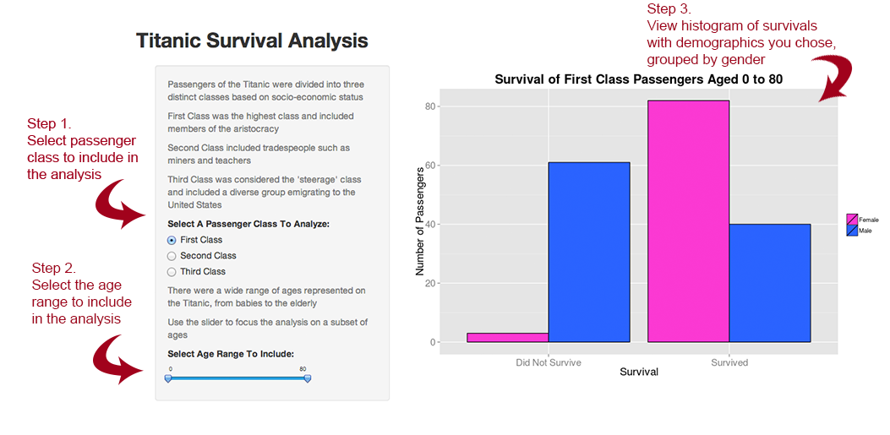

## Features

---

## Thank You!
Thank you very much for viewing this presentation! 
* [Titanic Survival Analysis Application](https://shanfu.shinyapps.io/DDP_shiny/)
* [Titanic Survival Analysis Github Repo](https://github.com/shannonrush/DDP_shiny)
* [This Presentation's Github Repo](https://github.com/shannonrush/DDP_slidify)
* [The Kaggle competition 'Titanic: Machine Learning from Disaster'](http://www.kaggle.com/c/titanic-gettingStarted)

